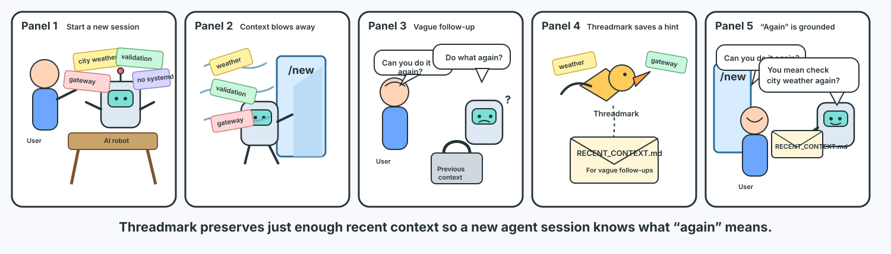

# Threadmark

Threadmark preserves a small active/recent context packet across agent session boundaries so vague follow-ups can be grounded safely.

Threadmark is portable in concept. This MVP currently implements and runtime-verifies only the OpenClaw adapter in `@threadmark/openclaw`.

Threadmark does not write archival memory or run `openclaw memory index`.

## Packages

- `@threadmark/core`: runtime-agnostic state, extraction, redaction, packet rendering, and atomic persistence.
- `@threadmark/openclaw`: OpenClaw managed hook, compaction plugin, transcript lookup, OpenClaw paths, and install scripts.

## OpenClaw adapter

- Managed hook id: `threadmark`
- Plugin id: `threadmark`
- Captures `/new` and `/reset` from OpenClaw session transcripts.
- Injects `RECENT_CONTEXT.md` during OpenClaw `agent:bootstrap`.
- Treats `before_compaction` as a signal-only path unless a transcript becomes available later.

## Manual Validation

Use a non-production OpenClaw instance when possible. If validating on a daily instance, back up OpenClaw config first and proceed one step at a time.

Only the OpenClaw adapter is currently implemented and runtime-verified.

If `OPENCLAW_HOME` is set, Threadmark writes continuity files under that OpenClaw home instead of `~/.openclaw`.

1. Run `packages/openclaw/scripts/install.sh --dry-run`.
2. Run `packages/openclaw/scripts/install.sh --yes --link` for linked local validation.
3. Restart OpenClaw gateway.
4. Confirm `openclaw hooks list` shows `threadmark` ready.
5. Confirm `openclaw plugins list` shows `threadmark` loaded.
6. Send a harmless marker message and run `/new`.
7. Confirm `~/.openclaw/continuity/state.json` and `RECENT_CONTEXT.md` exist.
8. Ask the next OpenClaw agent whether `RECENT_CONTEXT.md` appears in project context.
9. Send a harmless marker message and run `/reset`.
10. Confirm rotated transcript fallback works if the reported `.jsonl` file was renamed to `.jsonl.reset.*`.
11. Trigger compaction.
12. Inspect OpenClaw logs or hook/plugin diagnostics to verify whether `before_compaction` includes usable transcript messages. Threadmark treats compaction as signal-only until runtime evidence shows otherwise.
13. Confirm compaction creates a partial capture if no transcript can be resolved.
14. Run `packages/openclaw/scripts/uninstall.sh --yes` and restart OpenClaw gateway.
15. Note that uninstall disables the Threadmark hook/plugin but keeps `~/.openclaw/continuity/` for inspection. Remove it manually only after confirming you no longer need the captured context.
