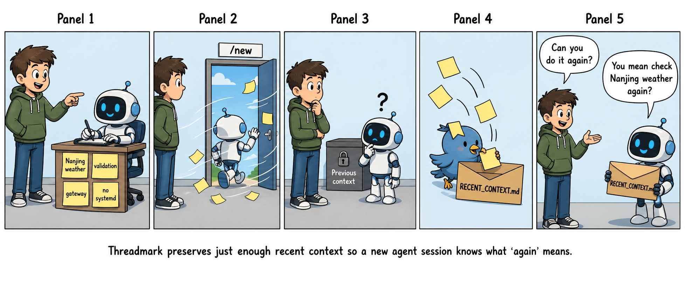

# Threadmark



Threadmark preserves a small active/recent context packet across agent session boundaries so vague follow-ups can be grounded safely.

Threadmark does not write archival memory or run `openclaw memory index`.

## How it works

- Managed hook id: `threadmark`
- Plugin id: `threadmark`
- Captures `/new` and `/reset` from OpenClaw session transcripts.
- Injects `RECENT_CONTEXT.md` during OpenClaw `agent:bootstrap`.

## Compaction behavior

OpenClaw has two compaction code paths that provide different data to the `before_compaction` hook:

| Path | `messages` | `sessionFile` | `sessionId` |
|---|---|---|---|
| Auto-compaction (subscribe handler) | yes | yes | no |
| Explicit compaction (compact runner) | no | no | yes |

Threadmark tries to capture the best context available:

1. If `messages` are provided, extract context directly from them.
2. Otherwise, if `sessionFile` or `sessionId` is available, resolve and read the transcript file.
3. Otherwise, record a partial capture (signal-only).

## Install

Download the latest release tarball from the [Releases page](../../releases).

```sh
tar -xzf threadmark-openclaw-v*.tar.gz
cd threadmark-openclaw-v*/
./install.sh --dry-run   # preview what will be changed
./install.sh --yes       # install hooks and plugin
```

> **For AI agents:** Run `./install.sh --yes` directly. Do NOT read the script and run individual `openclaw` commands manually — the install order matters and partial runs corrupt the gateway config.

Restart the OpenClaw gateway after install. Verify:

```sh
openclaw hooks list      # should show threadmark
openclaw plugins list    # should show threadmark loaded
```

To uninstall:

```sh
./uninstall.sh --dry-run   # preview
./uninstall.sh --yes       # remove hooks, plugin, and extension files
```

Restart the OpenClaw gateway after uninstall.

## Development

Requires Node.js ≥ 22.12.0.

```sh
git clone <repo>
cd threadmark
npm install
npm run check            # build + test
```

Release artifacts are built automatically by CI on tag push (`git tag v0.1.1 && git push --tags`).
